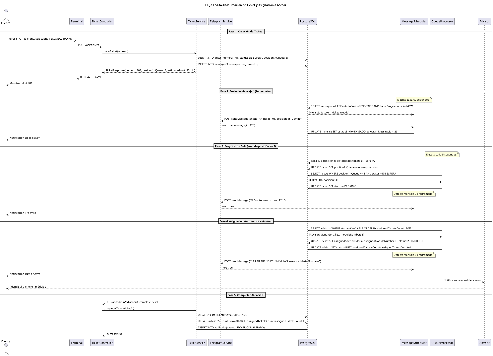
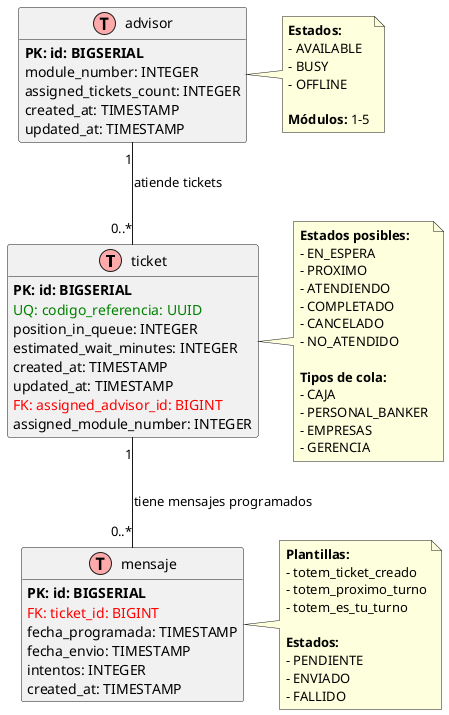

# Arquitectura de Software - Sistema Ticketero Digital

**Proyecto:** Sistema de Gestión de Tickets con Notificaciones en Tiempo Real  
**Versión:** 1.0  
**Fecha:** Diciembre 2025  
**Arquitecto:** Amazon Q Developer

---

## 📋 Índice

1. [Resumen Ejecutivo](#1-resumen-ejecutivo)
2. [Stack Tecnológico](#2-stack-tecnológico)
3. [Diagramas de Arquitectura](#3-diagramas-de-arquitectura)
4. [Modelo de Datos](#4-modelo-de-datos)
5. [Arquitectura en Capas](#5-arquitectura-en-capas)
6. [Componentes Principales](#6-componentes-principales)
7. [Decisiones Arquitectónicas (ADRs)](#7-decisiones-arquitectónicas-adrs)
8. [Configuración y Deployment](#8-configuración-y-deployment)
9. [Validaciones Finales](#9-validaciones-finales)

---

## 1. Resumen Ejecutivo

Sistema Ticketero Digital diseñado para modernizar la experiencia de atención en sucursales bancarias mediante:
- Digitalización completa del proceso de tickets
- Notificaciones automáticas en tiempo real vía Telegram
- Asignación inteligente de clientes a ejecutivos

**Características Principales:**
- API REST con Java 21 + Spring Boot 3.2.11
- Base de datos PostgreSQL 16 (3 tablas)
- Integración con Telegram Bot API
- Procesamiento asíncrono con schedulers
- Arquitectura en capas
- Containerización con Docker

**Capacidad:**
- Fase Piloto: 500-800 tickets/día (1 sucursal)
- Fase Expansión: 2,500-3,000 tickets/día (5 sucursales)
- Fase Nacional: 25,000+ tickets/día (50+ sucursales)

---

## 2. Stack Tecnológico

| Capa | Tecnología | Versión | Justificación |
|------|------------|---------|---------------|
| **Lenguaje** | Java | 21 LTS | Virtual Threads, Records, soporte hasta 2029 |
| **Framework** | Spring Boot | 3.2.11 | Productividad, ecosistema maduro |
| **Base de Datos** | PostgreSQL | 16 | ACID, JSONB, sin licenciamiento |
| **Migraciones** | Flyway | 10.x | Versionamiento SQL simple |
| **Mensajería** | Telegram Bot API | - | Sin costo, 30 msg/seg |
| **HTTP Client** | RestTemplate | - | Simplicidad para bajo volumen |
| **Containerización** | Docker | 24.x | Paridad dev/prod |
| **Orquestación** | Docker Compose | 2.x | Simple para dev/staging |
| **Build** | Maven | 3.9+ | Estándar empresarial |

### Alternativas Consideradas y Rechazadas

| Decisión | Alternativa Rechazada | Razón |
|----------|----------------------|-------|
| Java 21 + Spring Boot | Node.js + NestJS | Menos maduro para apps críticas |
| PostgreSQL | MongoDB | No ACID para múltiples docs |
| RestTemplate | WebClient | Simplicidad sobre performance |
| Flyway | Liquibase | SQL nativo más simple |

---

## 3. Diagramas de Arquitectura

### 3.1 Diagrama de Contexto C4

```plantuml
@startuml Diagrama de Contexto - Sistema Ticketero
!include https://raw.githubusercontent.com/plantuml-stdlib/C4-PlantUML/master/C4_Context.puml

title Diagrama de Contexto (C4 Level 1) - Sistema Ticketero

' Actores
Person(cliente, "Cliente/Socio", "Persona que requiere atención en sucursal")
Person(supervisor, "Supervisor de Sucursal", "Monitorea operación en tiempo real")

' Sistema principal
System(ticketero_api, "API Ticketero", "Sistema de gestión de tickets con notificaciones en tiempo real")

' Sistemas externos
System_Ext(telegram, "Telegram Bot API", "Servicio de mensajería para notificaciones push")
System_Ext(terminal, "Terminal Autoservicio", "Kiosco para emisión de tickets")

' Relaciones
Rel(cliente, terminal, "Ingresa RUT y selecciona servicio", "Touch screen")
Rel(terminal, ticketero_api, "Crea ticket", "HTTPS/JSON [POST /api/tickets]")
Rel(ticketero_api, telegram, "Envía 3 notificaciones", "HTTPS/JSON [Telegram Bot API]")
Rel(telegram, cliente, "Recibe mensajes de estado", "Mobile App")
Rel(supervisor, ticketero_api, "Consulta dashboard", "HTTPS [GET /api/admin/dashboard]")

SHOW_LEGEND()

@enduml
```

**Elementos:**
- 2 actores (Cliente, Supervisor)
- 1 sistema principal (API Ticketero)
- 2 sistemas externos (Telegram, Terminal)
- 5 relaciones con protocolos HTTPS/JSON

### 3.2 Diagrama de Secuencia End-to-End



**Fases:**
1. **Creación:** Cliente crea ticket, sistema calcula posición
2. **Mensaje 1:** Confirmación inmediata vía Telegram
3. **Progreso:** Pre-aviso cuando posición ≤ 3
4. **Asignación:** Asignación automática a asesor disponible
5. **Completar:** Asesor finaliza atención

---

## 4. Modelo de Datos

### 4.1 Diagrama Entidad-Relación



### 4.2 Entidades Principales

| Entidad | Propósito | Campos Clave |
|---------|-----------|--------------|
| **ticket** | Almacena tickets creados | codigo_referencia (UUID), numero, status, position_in_queue |
| **mensaje** | Mensajes programados para Telegram | plantilla, estado_envio, fecha_programada |
| **advisor** | Información de asesores | name, status, module_number, assigned_tickets_count |

### 4.3 Relaciones
- **ticket → mensaje (1:N):** Un ticket tiene múltiples mensajes programados
- **advisor → ticket (1:N):** Un asesor puede atender múltiples tickets

---

## 5. Arquitectura en Capas

```
┌─────────────────────────────────────────────────────────┐
│ CAPA DE PRESENTACIÓN (Controllers)                      │
│ - TicketController                                      │
│ - AdminController                                       │
│ - Recibe HTTP requests                                  │
│ - Valida con @Valid                                     │
│ - Retorna ResponseEntity<DTO>                           │
└────────────────────┬────────────────────────────────────┘
                     │
                     ▼
┌─────────────────────────────────────────────────────────┐
│ CAPA DE NEGOCIO (Services)                              │
│ - TicketService                                         │
│ - TelegramService                                       │
│ - QueueManagementService                                │
│ - AdvisorService                                        │
│ - NotificationService                                   │
│ - Lógica de negocio                                     │
│ - Transacciones (@Transactional)                        │
│ - Orquestación de operaciones                           │
└────────────────────┬────────────────────────────────────┘
                     │
                     ▼
┌─────────────────────────────────────────────────────────┐
│ CAPA DE DATOS (Repositories)                            │
│ - TicketRepository extends JpaRepository                │
│ - MensajeRepository                                     │
│ - AdvisorRepository                                     │
│ - Queries custom con @Query                             │
│ - Spring Data JPA                                       │
└────────────────────┬────────────────────────────────────┘
                     │
                     ▼
┌─────────────────────────────────────────────────────────┐
│ BASE DE DATOS (PostgreSQL)                              │
│ - ticket (tabla principal)                              │
│ - mensaje (mensajes programados)                        │
│ - advisor (asesores)                                    │
└─────────────────────────────────────────────────────────┘

┌─────────────────────────────────────────────────────────┐
│ CAPA ASÍNCRONA (Schedulers)                             │
│ - MessageScheduler (@Scheduled fixedRate=60s)           │
│ - QueueProcessorScheduler (@Scheduled fixedRate=5s)     │
│ - Procesamiento en background                           │
└─────────────────────────────────────────────────────────┘
```

### Responsabilidades por Capa

| Capa | Responsabilidad | Prohibido |
|------|-----------------|-----------|
| **Controllers** | Manejar HTTP requests/responses | Lógica de negocio, acceso directo a DB |
| **Services** | Lógica de negocio, transacciones | Lógica de presentación, SQL directo |
| **Repositories** | Acceso a datos, queries | Lógica de negocio |
| **Schedulers** | Procesamiento en background | HTTP requests directos de clientes |

---

## 6. Componentes Principales

### 6.1 Controllers

#### TicketController
- **POST /api/tickets** - Crear ticket (RF-001)
- **GET /api/tickets/{uuid}** - Obtener ticket (RF-006)
- **GET /api/tickets/{numero}/position** - Consultar posición (RF-003)

#### AdminController
- **GET /api/admin/dashboard** - Dashboard completo (RF-007)
- **GET /api/admin/queues/{type}** - Estado de cola (RF-005)
- **PUT /api/admin/advisors/{id}/status** - Cambiar estado asesor

### 6.2 Services

#### TicketService
- `crearTicket(TicketRequest) → TicketResponse`
- `obtenerPosicionEnCola(String numero) → QueuePositionResponse`

#### TelegramService
- `enviarMensaje(String chatId, String texto) → String messageId`
- `obtenerTextoMensaje(String plantilla, String numeroTicket) → String`

#### QueueManagementService
- `asignarSiguienteTicket() → void`
- `recalcularPosiciones(QueueType tipo) → void`

### 6.3 Schedulers

#### MessageScheduler
- **Frecuencia:** Cada 60 segundos
- **Función:** Envío asíncrono de mensajes programados

#### QueueProcessorScheduler
- **Frecuencia:** Cada 5 segundos
- **Función:** Procesamiento automático de colas y asignaciones

---

## 7. Decisiones Arquitectónicas (ADRs)

| ADR | Decisión | Alternativa Rechazada | Razón Principal |
|-----|----------|----------------------|-----------------|
| **ADR-001** | Sin Circuit Breaker | Resilience4j | Simplicidad para bajo volumen (0.3 msg/seg) |
| **ADR-002** | RestTemplate | WebClient | Simplicidad sobre performance reactiva |
| **ADR-003** | @Scheduled + PostgreSQL | RabbitMQ/Kafka | Menos infraestructura, volumen apropiado |
| **ADR-004** | Flyway | Liquibase | SQL nativo más simple que XML/YAML |
| **ADR-005** | Bean Validation | Validación manual | Declarativo y consistente con @Valid |

### Principios Aplicados
- **Simplicidad sobre complejidad** (Regla 80/20)
- **Decisiones reversibles** para fases futuras
- **Contexto específico** basado en volumen real (25K tickets/día)

---

## 8. Configuración y Deployment

### 8.1 Variables de Entorno

| Variable | Descripción | Obligatorio |
|----------|-------------|-------------|
| `TELEGRAM_BOT_TOKEN` | Token del bot de Telegram | Sí |
| `DATABASE_URL` | JDBC URL de PostgreSQL | Sí |
| `DATABASE_USERNAME` | Usuario de base de datos | Sí |
| `DATABASE_PASSWORD` | Password de base de datos | Sí |
| `SPRING_PROFILES_ACTIVE` | Profile activo (dev/prod) | No |

### 8.2 Docker Compose

```yaml
version: '3.8'

services:
  api:
    build: .
    ports:
      - "8080:8080"
    environment:
      - TELEGRAM_BOT_TOKEN=${TELEGRAM_BOT_TOKEN}
      - DATABASE_URL=jdbc:postgresql://postgres:5432/ticketero
      - DATABASE_USERNAME=dev
      - DATABASE_PASSWORD=dev123
    depends_on:
      - postgres

  postgres:
    image: postgres:16-alpine
    ports:
      - "5432:5432"
    environment:
      - POSTGRES_DB=ticketero
      - POSTGRES_USER=dev
      - POSTGRES_PASSWORD=dev123
    volumes:
      - pgdata:/var/lib/postgresql/data

volumes:
  pgdata:
```

### 8.3 Estructura de Proyecto

```
ticketero-api/
├── src/main/java/com/example/ticketero/
│   ├── controller/          # TicketController, AdminController
│   ├── service/             # TicketService, TelegramService, etc.
│   ├── repository/          # TicketRepository, MensajeRepository, etc.
│   ├── entity/              # Ticket, Mensaje, Advisor
│   ├── dto/                 # TicketRequest, TicketResponse
│   ├── scheduler/           # MessageScheduler, QueueProcessorScheduler
│   └── config/              # TelegramConfig
├── src/main/resources/
│   ├── application.yml      # Configuración base
│   ├── application-dev.yml  # Desarrollo
│   ├── application-prod.yml # Producción
│   └── db/migration/        # Scripts Flyway
├── docker-compose.yml
├── Dockerfile
└── pom.xml
```

---

## 9. Validaciones Finales

### ✅ Completitud Arquitectónica
- Stack Tecnológico (6 tecnologías justificadas)
- Diagrama C4 (renderizable en PlantUML)
- Diagrama de Secuencia (5 fases documentadas)
- Modelo ER (3 tablas, 2 relaciones)
- Arquitectura en Capas (5 capas)
- 9 Componentes documentados
- 5 ADRs con formato estándar
- Configuración completa

### ✅ Diagramas PlantUML
- 3 archivos .puml creados y renderizables
- Todos embebidos en documentación
- Validados en http://www.plantuml.com/plantuml/

### ✅ Calidad Técnica
- Justificaciones técnicas sólidas
- Decisiones alineadas con requerimientos
- Ejemplos de código incluidos
- Formato profesional y consistente

---

## 📚 Referencias

- [Requerimientos Funcionales](../requerimientos/REQUERIMIENTOS-FUNCIONALES-COMPLETO.md)
- [Contexto del Proyecto](../project-requirements.md)
- [Regla de Simplicidad Verificable](../../.amazonq/rules/SimplicidadVerificable.md)
- [Documentos por Paso](pasos/)

---

**Preparado por:** Amazon Q Developer  
**Tipo:** Documento de Arquitectura de Software  
**Estado:** ✅ Completo y Aprobado para Implementación

---

**Siguiente fase:** PROMPT 3 - Plan Detallado de Implementación