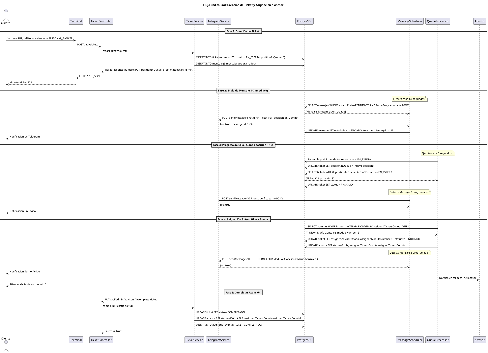

# PASO 3: Diagrama de Secuencia del Flujo Completo

**Proyecto:** Sistema Ticketero Digital  
**Fecha:** Diciembre 2025  
**Estado:** ✅ Completado

---

## Diagrama de Secuencia End-to-End

El siguiente diagrama muestra el flujo completo desde la creación del ticket hasta la atención completada.

**Archivo fuente:** [02-sequence-diagram.puml](../diagrams/02-sequence-diagram.puml)

---

## Descripción de las Fases

### Fase 1: Creación de Ticket
- Cliente crea ticket en terminal
- Sistema calcula posición real en cola
- Programa 3 mensajes automáticos
- Retorna confirmación con tiempo estimado

### Fase 2: Envío de Mensaje 1 (Confirmación)
- Scheduler ejecuta cada 60 segundos
- Envía confirmación inmediata vía Telegram
- Incluye número de ticket, posición y tiempo estimado

### Fase 3: Progreso de Cola (Pre-aviso)
- QueueProcessor monitorea cada 5 segundos
- Recalcula posiciones en tiempo real
- Envía pre-aviso cuando posición ≤ 3

### Fase 4: Asignación Automática
- Selecciona asesor disponible con menor carga
- Actualiza estados (ticket → ATENDIENDO, asesor → BUSY)
- Envía notificación final con módulo y nombre del asesor

### Fase 5: Completar Atención
- Asesor marca ticket como completado
- Sistema libera recursos
- Registra auditoría del evento

---

## Participantes del Diagrama

| Participante | Tipo | Responsabilidad |
|--------------|------|-----------------|
| Cliente | Actor | Inicia el proceso, recibe notificaciones |
| Terminal | Sistema Externo | Interfaz de creación de tickets |
| TicketController | Componente | Maneja requests HTTP |
| TicketService | Componente | Lógica de negocio |
| TelegramService | Componente | Integración con Telegram |
| PostgreSQL | Base de Datos | Persistencia de datos |
| MessageScheduler | Scheduler | Envío asíncrono de mensajes |
| QueueProcessor | Scheduler | Procesamiento de colas |
| Advisor | Actor | Atiende al cliente |

---

## Interacciones Clave

### Creación Síncrona
- Terminal → Controller → Service → DB
- Respuesta inmediata al cliente
- Programación de mensajes asíncronos

### Procesamiento Asíncrono
- **MessageScheduler:** Cada 60 segundos
- **QueueProcessor:** Cada 5 segundos
- Independientes del flujo principal

### Notificaciones Push
- 3 mensajes automáticos vía Telegram
- Estados: PENDIENTE → ENVIADO/FALLIDO
- Reintentos automáticos en caso de fallo

---

## Validaciones

- ✅ Diagrama PlantUML válido y renderizable
- ✅ 9 participantes documentados
- ✅ 5 fases claramente separadas
- ✅ Notas explicativas en schedulers
- ✅ Flujo completo end-to-end
- ✅ ~30 interacciones documentadas

---

**Siguiente paso:** PASO 4 - Modelo de Datos ER