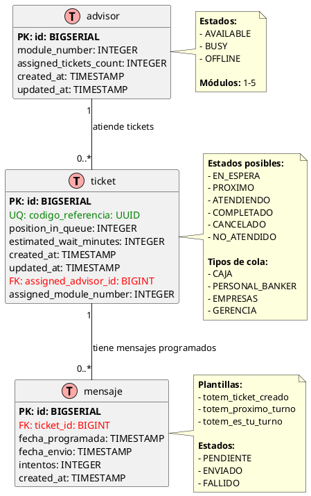

# PASO 4: Modelo de Datos ER

**Proyecto:** Sistema Ticketero Digital  
**Fecha:** Diciembre 2025  
**Estado:** ✅ Completado

---

## Diagrama Entidad-Relación

El siguiente diagrama muestra el modelo entidad-relación de la base de datos PostgreSQL.



**Archivo fuente:** [03-er-diagram.puml](../diagrams/03-er-diagram.puml)

---

## Descripción de Entidades

### Tabla: ticket
**Propósito:** Almacena información de tickets creados por clientes

| Campo | Tipo | Descripción |
|-------|------|-------------|
| id | BIGSERIAL | Primary key autoincremental |
| codigo_referencia | UUID | Identificador único para consultas externas |
| numero | VARCHAR(10) | Número visible del ticket (P01, C15, etc.) |
| national_id | VARCHAR(20) | RUT/ID del cliente |
| telefono | VARCHAR(20) | Teléfono para notificaciones Telegram |
| branch_office | VARCHAR(100) | Sucursal donde se creó el ticket |
| queue_type | VARCHAR(20) | Tipo de cola (CAJA, PERSONAL_BANKER, etc.) |
| status | VARCHAR(20) | Estado actual del ticket |
| position_in_queue | INTEGER | Posición actual en la cola |
| estimated_wait_minutes | INTEGER | Tiempo estimado de espera |
| assigned_advisor_id | BIGINT | FK al asesor asignado (nullable) |
| assigned_module_number | INTEGER | Número del módulo asignado |
| created_at | TIMESTAMP | Fecha de creación |
| updated_at | TIMESTAMP | Última actualización |

### Tabla: mensaje
**Propósito:** Almacena mensajes programados para envío vía Telegram

| Campo | Tipo | Descripción |
|-------|------|-------------|
| id | BIGSERIAL | Primary key autoincremental |
| ticket_id | BIGINT | FK al ticket relacionado |
| plantilla | VARCHAR(50) | Tipo de mensaje (totem_ticket_creado, etc.) |
| estado_envio | VARCHAR(20) | Estado del envío (PENDIENTE, ENVIADO, FALLIDO) |
| fecha_programada | TIMESTAMP | Cuándo debe enviarse el mensaje |
| fecha_envio | TIMESTAMP | Cuándo se envió realmente (nullable) |
| telegram_message_id | VARCHAR(50) | ID del mensaje en Telegram (nullable) |
| intentos | INTEGER | Número de intentos de envío |
| created_at | TIMESTAMP | Fecha de creación |

### Tabla: advisor
**Propósito:** Almacena información de asesores/ejecutivos

| Campo | Tipo | Descripción |
|-------|------|-------------|
| id | BIGSERIAL | Primary key autoincremental |
| name | VARCHAR(100) | Nombre completo del asesor |
| email | VARCHAR(100) | Email corporativo |
| status | VARCHAR(20) | Estado actual (AVAILABLE, BUSY, OFFLINE) |
| module_number | INTEGER | Número del módulo asignado (1-5) |
| assigned_tickets_count | INTEGER | Contador de tickets asignados |
| created_at | TIMESTAMP | Fecha de creación |
| updated_at | TIMESTAMP | Última actualización |

---

## Relaciones

### ticket → mensaje (1:N)
- Un ticket puede tener múltiples mensajes programados
- Cada mensaje pertenece a un único ticket
- Relación: `ticket.id = mensaje.ticket_id`

### advisor → ticket (1:N)
- Un asesor puede atender múltiples tickets (históricamente)
- Solo 1 ticket en estado ATENDIENDO simultáneamente
- Relación: `advisor.id = ticket.assigned_advisor_id`

---

## Índices Importantes

### Índices de Performance
```sql
-- Búsqueda rápida por UUID
CREATE UNIQUE INDEX idx_ticket_codigo_referencia ON ticket(codigo_referencia);

-- Búsqueda por número de ticket
CREATE UNIQUE INDEX idx_ticket_numero ON ticket(numero);

-- Validación de ticket activo por cliente
CREATE INDEX idx_ticket_national_id_status ON ticket(national_id, status);

-- Filtrado de tickets por estado
CREATE INDEX idx_ticket_status ON ticket(status);

-- Query del scheduler para mensajes pendientes
CREATE INDEX idx_mensaje_estado_fecha ON mensaje(estado_envio, fecha_programada);

-- Selección de asesores disponibles
CREATE INDEX idx_advisor_status ON advisor(status);
```

### Constraints Únicos
- `ticket.codigo_referencia` (UUID único)
- `ticket.numero` (número único por día)
- `advisor.module_number` (un asesor por módulo)

---

## Enumeraciones

### TicketStatus
- `EN_ESPERA`: Esperando asignación a asesor
- `PROXIMO`: Próximo a ser atendido (posición ≤ 3)
- `ATENDIENDO`: Siendo atendido por un asesor
- `COMPLETADO`: Atención finalizada exitosamente
- `CANCELADO`: Cancelado por cliente o sistema
- `NO_ATENDIDO`: Cliente no se presentó

### QueueType
- `CAJA`: Transacciones básicas (5 min promedio)
- `PERSONAL_BANKER`: Productos financieros (15 min promedio)
- `EMPRESAS`: Clientes corporativos (20 min promedio)
- `GERENCIA`: Casos especiales (30 min promedio)

### MessageTemplate
- `totem_ticket_creado`: Confirmación inmediata
- `totem_proximo_turno`: Pre-aviso (posición ≤ 3)
- `totem_es_tu_turno`: Turno activo con módulo

### MessageStatus
- `PENDIENTE`: Esperando envío
- `ENVIADO`: Enviado exitosamente
- `FALLIDO`: Falló después de 3 reintentos

### AdvisorStatus
- `AVAILABLE`: Disponible para asignaciones
- `BUSY`: Atendiendo cliente
- `OFFLINE`: No disponible

---

## Validaciones

- ✅ Diagrama PlantUML válido y renderizable
- ✅ 3 tablas documentadas (ticket, mensaje, advisor)
- ✅ Todos los campos con tipos PostgreSQL
- ✅ Primary keys, Foreign keys, Unique constraints marcadas
- ✅ 2 relaciones documentadas (1:N)
- ✅ Notas con enumeraciones incluidas
- ✅ Índices de performance especificados

---

**Siguiente paso:** PASO 5 - Arquitectura en Capas